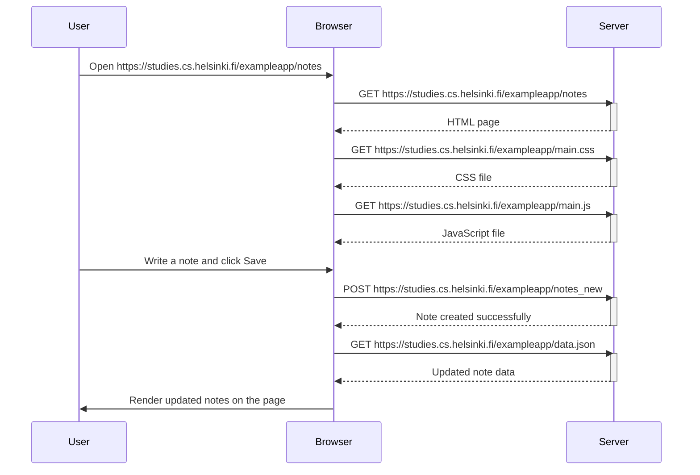

## Here's a sequence diagram using Mermaid syntax depicting the scenario where the user creates a new note on the page https://studies.cs.helsinki.fi/exampleapp/notes

```mermaid
sequenceDiagram
    participant User
    participant Browser
    participant Server

    User->>Browser: Open https://studies.cs.helsinki.fi/exampleapp/notes
    Browser->>Server: GET https://studies.cs.helsinki.fi/exampleapp/notes
    activate Server
    Server-->>Browser: HTML page
    deactivate Server
    Browser->>Server: GET https://studies.cs.helsinki.fi/exampleapp/main.css
    activate Server
    Server-->>Browser: CSS file
    deactivate Server
    Browser->>Server: GET https://studies.cs.helsinki.fi/exampleapp/main.js
    activate Server
    Server-->>Browser: JavaScript file
    deactivate Server

    User->>Browser: Write a note and click Save
    Browser->>Server: POST https://studies.cs.helsinki.fi/exampleapp/notes_new
    activate Server
    Server-->>Browser: Note created successfully
    deactivate Server

    Browser->>Server: GET https://studies.cs.helsinki.fi/exampleapp/data.json
    activate Server
    Server-->>Browser: Updated note data
    deactivate Server

    Browser->>User: Render updated notes on the page
    
```
