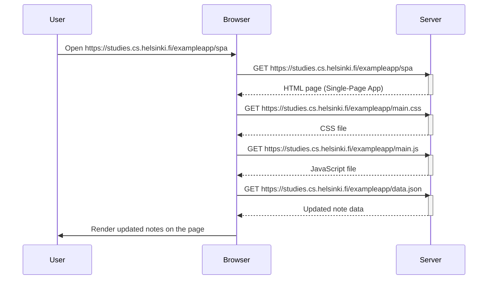

## here's a Mermaid syntax diagram depicting the scenario where the user goes to the single-page app (SPA) version of the notes app at https://studies.cs.helsinki.fi/exampleapp/spa:

```mermaid
sequenceDiagram
    participant User
    participant Browser
    participant Server

    User->>Browser: Open https://studies.cs.helsinki.fi/exampleapp/spa
    Browser->>Server: GET https://studies.cs.helsinki.fi/exampleapp/spa
    activate Server
    Server-->>Browser: HTML page (Single-Page App)
    deactivate Server
    Browser->>Server: GET https://studies.cs.helsinki.fi/exampleapp/main.css
    activate Server
    Server-->>Browser: CSS file
    deactivate Server
    Browser->>Server: GET https://studies.cs.helsinki.fi/exampleapp/main.js
    activate Server
    Server-->>Browser: JavaScript file
    deactivate Server

    Browser->>Server: GET https://studies.cs.helsinki.fi/exampleapp/data.json
    activate Server
    Server-->>Browser: Updated note data
    deactivate Server

    Browser->>User: Render updated notes on the page

```
